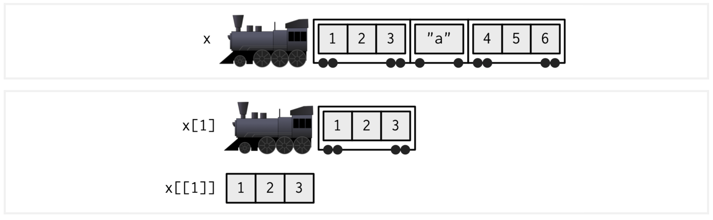
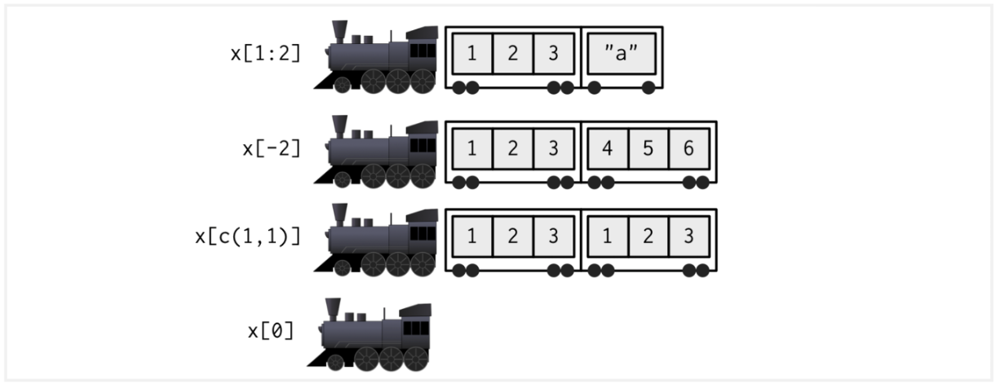

```{r xaringanExtra-clipboard, echo=FALSE}
xaringanExtra::use_clipboard()
```

# Let's recap

- How do we access vector elements?
- How do we modify vector contents?
- How do we create a matrix?
- What operations can we make with a matrix?
- How do we select/extract data from a matrix?

---

# Data structures in R

- Vectors
- Matrices
- Lists
- Data frames
- Functions

---
class: chapter-slide

# Lists

---

# Lists

- A list is an ordered collection of objects, known as components.

- Components can be of different size and class. 

- Lists can contain vectors, matrices, strings, data frames, functions, etc.

---
# How do we create a list?

```{r}
fruits <- list(name = "apple",
               quantity = 5,
               properties = c("small", "red", "rounded"))

fruits
```

How does the list look like using View( )?

---
# How do we access list elements?

## Using index

```{r, echo=FALSE, out.width='100%'}

```
Image from [Chapter 4 Subsetting. Advanced R. Second ed.](https://adv-r.hadley.nz/subsetting.html) by Hadley Wickham

---
# How do we access list elements?

## Using index

.pull-left[
```{r}
fruits[1]
fruits[[1]]
```
]

.pull-right[
```{r}
class(fruits[1])
class(fruits[[1]])
```
]

---
# Your turn!

- How would you extract the number of apples?

- How would you extract the word "red" from the properties of the apple?

---
# How do we access list elements?

<br>
```{r, echo=FALSE, out.width='100%'}

```
Image from [Chapter 4 Subsetting. Advanced R. Second ed.](https://adv-r.hadley.nz/subsetting.html) by Hadley Wickham

---
- Extract the name and number of apples

```{r}
fruits[1:2]
```

- Extract all elements except the number of apples

```{r}
fruits[-2]
```

---
# How do we access list elements?

## Using the name

```{r}
fruits["name"]

fruits["properties"]
```

---
## Access elements using $

```{r}
fruits

fruits$name
```

Only one element can be extracted with $

---
# Your turn!

- Use $ to extract the number of apples

- How would you extract the word "rounded" from the apple properties using $?

---
# How do we add a new element to the list?

```{r}
fruits["edible_shell"] <- TRUE
fruits
```

---
# How do we add a new element to the list?

```{r}
fruits$hard_shell <- FALSE
fruits
```

---
# Your turn!

Create a list with a patient information

```{r}
patient_1 <- list(name = "John",
                  last_name = "Doe",
                  weight = 170,
                  glucose = c(85, 90, 87, 89, 91))
```

- Extract the patient's name and last name
- Extract the glucose levels of days 3 to 5
- Remove the weight
- Add a new element to the list containing blood pressure levels

---
class: chapter-slide

# Data Frames

---

# What is a data frame?

- Two-dimensional arranged data (tables)
- rows and columns
- All columns must be the same length
- Data frames can have different type of data
- All elements in a column must be the same type (vector)

---
# Creating a data frame

```{r}
fruits <- data.frame(
  
  name = c("apples","berries","mangos","bananas"),  
  number = c(1, 10, 7, 2),
  edible_shell = c(TRUE,TRUE,FALSE,FALSE) )

fruits
```

---

# Properties of data frames

- nrow

```{r}
nrow(fruits)
```

- ncol

```{r}
ncol(fruits)
```

---

- dim

```{r}
dim(fruits)
```

--

- rownames

```{r}
rownames(fruits)
```

- colnames

```{r}
colnames(fruits)
```

---
## Let's practice

Create a data frame (patients) that contains the following information:

```{r, echo=FALSE}
patients <- data.frame(first_name = c("Ava","Richard","Olivia"), 
                       last_name =  c("Smith", "Brown", "Williams" ),
                       age = c(65, 20, 47),
                       co_morbidity = c(TRUE, FALSE, FALSE)
)
patients
```

- How many rows and columns does the data frame have?
- Print the columns and rows names

---
class: chapter-slide

# How do we access data frame elements?

---

# Using row and column index

Syntaxis: df[row, column]

```{r}
fruits
fruits[2,3]
```

---

Select rows 1 to 2 from column 3

```{r}
fruits[1:2,3]
```

---
## Your turn!

Using the patients data frame 

```{r, echo=FALSE}
patients <- data.frame(first_name = c("Ava","Richard","Olivia"), 
                       last_name =  c("Smith", "Brown", "Williams" ),
                       age = c(65, 20, 47),
                       co_morbidity = c(TRUE, FALSE, FALSE)
)
patients
```

- Extract the last name and age from Ava and Richard 

---

- Select all rows from column 2

```{r}
fruits[,2]
```

- Select all columns from row 2

```{r}
fruits[2,]
```

---
## Your turn!

Using the patients data frame 

```{r, echo=FALSE}
patients <- data.frame(first_name = c("Ava","Richard","Olivia"), 
                       last_name =  c("Smith", "Brown", "Williams" ),
                       age = c(65, 20, 47),
                       co_morbidity = c(TRUE, FALSE, FALSE)
)
patients
```

- Extract all the information (columns) from Olivia.
- Extract the age from all patients

---

# Using the $ symbol

Syntaxis: df$column_name

- Extract the fruits name

```{r}
fruits$name
```

--

- What type of structure has the result?

```{r}
class(fruits$name)
```

---

## Your turn!

Using the patients data frame 

```{r, echo=FALSE}
patients <- data.frame(first_name = c("Ava","Richard","Olivia"), 
                       last_name =  c("Smith", "Brown", "Williams" ),
                       age = c(65, 20, 47),
                       co_morbidity = c(TRUE, FALSE, FALSE)
)
patients
```

- Extract the last_name column using the $ symbol
- Extract the age column. What's the class of the result?
- How do you extract the age of Richard using the previous result?

---
# How do we add a column?

```{r}
cbind(fruits, 
      "hard_shell" = c(FALSE, FALSE, FALSE, FALSE))
fruits
```

---
# How do we add a column?

```{r}
fruits$hard_shell <- c(FALSE, FALSE, FALSE, FALSE)

fruits
```

---
# How do we add a new row?

```{r}
rbind(fruits, c("coconut", 3, FALSE, TRUE))
fruits
```

---
# Your turn!

```{r}
patients
```

- Add a new column ("glucose") with glucose levels

- Add a new patient (row)

---

.pull-left[<br><br><br><br><br><br><br>
.center[
# Thanks!
]
]

.pull-right[<br><br><br><br><br>
```{r,echo=FALSE,out.width='110%',fig.align='center'}
knitr::include_graphics("img/thanks.png")
```
]
