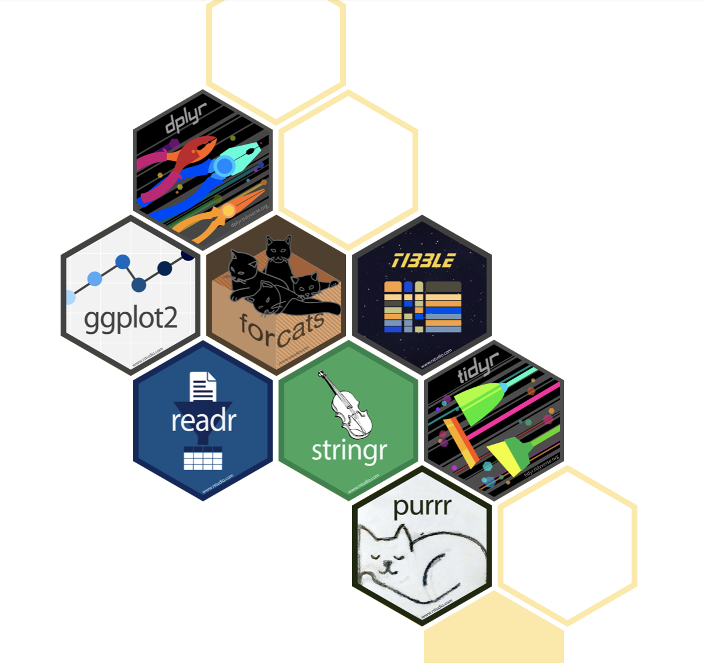

```{r xaringanExtra-clipboard, echo=FALSE}
xaringanExtra::use_clipboard()
```

# Let's recap

- What are the properties of data frames?
- What are the properties of lists?
- How do we access the data of a data frame?
- How do we access the data of a list?

---
# What is Tidyverse?

.pull-left[
```{r, echo=FALSE,out.width='100%', fig.align='center'}

```
.center[<https://www.tidyverse.org>]
]

.pull-left[<br>
- A collection of R packages designed for data science. 

- The packages share a philosophy of design, grammar and data structure.
]

---
# Which packages are part of the Tidyverse?

## Tidyverse base

- **ggplot2**: creation of graphics
- **dplyr**: data handling
- **tidyr**: tidy data array
- **readr**: reading and writing of tabular data
- purrr: functional programming
- **tibble**: re-design of data frames
- **stringr**: text handling (strings)

---
## Reading data

- **readxl**: reading . xls and . xlsx
- **googlesheets4**: reading Google Sheets
- **DBI**: relational databases
- haven: SPSS, Stata, and SAS data
- httr: web APIs.
- googledrive: reading Google Drive files
- rvest: web scraping.
- jsonlite: JSON
- xml2: XML reading

---

.pull-left[
## Handling data
- **lubridate**: handling dates
- hms: time zones.
- blob: binary data storage

## Modeling
- **tidymodels**: modeling and machine learning
]

.pull-right[
## Programming
- **magrittr**: provides pipe %>% and other specialized operators (%$%, %<>%)
- glue: alternative to paste() to combine data and text
]

---
# Tidyverse packages for data analysis

```{r, echo=FALSE, out.width='100%', fig.align='center'}
knitr::include_graphics("img/whytidyverse.png")
```
.center[Image from [Why the tidyverse](https://rviews.rstudio.com/2017/06/08/what-is-the-tidyverse/) by Joseph Rickert]

---
# tibbles

```{r, echo=FALSE, out.width='100%'}
knitr::include_graphics("img/tidydata.jpg")
```
.center[Artwork by @allison_horst]

---
# tibbles

```{r, message=FALSE, warning=FALSE}
library(dplyr)

df <- data.frame(x = letters, 
                 y = 1:26, 
                 z = sample(c(TRUE, FALSE), 26, 
                            replace = TRUE))
dt <- tibble(x = letters, 
                 y = 1:26, 
                 z = sample(c(TRUE, FALSE), 26, 
                            replace = TRUE))
```

---
## Differences between data frames and tibbles

.pull-left[
```{r}
head(df)
```
]

.pull-right[
```{r}
head(dt)
```
]

---
# Reading and writing of tibbles

```{r, message=FALSE}
library(readr)

sinai_covid <- read_csv("Sinai_covid.csv")
```

```{r, eval=FALSE}
head(sinai_covid)

write_csv(sinai_covid, "printed_sinai_covid.csv")
```

---
# Arrange

```{r}
library(dplyr)

arrange(sinai_covid, by = age)
```

---
# Filter

```{r, echo=FALSE, out.width='100%'}
knitr::include_graphics("img/filter.png")
```

---
# Filter

```{r}
filter(sinai_covid, age > 50)
```

---
# Filter

```{r}
filter(sinai_covid, age > 50 & sex == "FEMALE")
```

---
# Filter

```{r}
filter(sinai_covid, age > 50, sex == "FEMALE")
```

---
# Filter

```{r}
filter(sinai_covid, age > 50 | sex == "FEMALE")
```

---
# Select

```{r}
select(sinai_covid, id, age, facility)
```

---
## Combine functions

```{r}
x <- filter(sinai_covid, age > 50)

x <- select(x, id, age, facility)

arrange(x, age)
```

---
# Your turn!

Use sinai_covid tibble

- Extract all patients from THE MOUNT SINAI HOSPITAL and MOUNT SINAI BI BROOKLYN

- Select id, sex, ethnicity and bmi

- Order the result by bmi

---
# Mutate

```{r, echo=FALSE, out.width='80%', fig.align='center'}
knitr::include_graphics("img/mutate.png")
```

---
# Mutate

```{r}
x <- mutate(sinai_covid, bmi_log = log10(bmi))

select(x, id, bmi, bmi_log)
```

---
# Mutate

```{r}
x <- mutate(sinai_covid, 
            new_facility = paste("Facility:",facility))

select(x, id, new_facility)
```

---
# Mutate

```{r}
x <- mutate(sinai_covid, 
            facility = tolower(facility))

select(x, id, facility)
```

---
# Your turn!

Use mutate to:

- Add a new column "random_num" adding random numbers (tip: use rnorm) 

- Change sex column from uppercase to lowercase

- Add a new column with the result of multiplying bmi by 10

---
# Count

```{r}
count(sinai_covid, facility)
```

---
# Summarise

```{r}
summarise(sinai_covid, mean_age = mean(age))
```

---
# Group

```{r}
x <- group_by(sinai_covid, facility)

summarise(x, mean_age = mean(age))
```

---
# Combining functions using the pipe

```{r}
group_by(sinai_covid, facility) %>% 
  summarise(mean_age = mean(age))
```

---
# Combining functions using the pipe

```{r}
sinai_covid %>% 
  group_by(facility) %>% 
  summarise(mean_age = mean(age))
```

---
# Combining functions using the pipe

```{r}
sinai_covid %>% 
  filter(age > 50) %>% 
  count(facility, name = "patients_older_than_50")
```

---
# Your turn!

## Exercise 1

Use the pipe to:

- Extract all patients from THE MOUNT SINAI HOSPITAL and MOUNT SINAI BI BROOKLYN

- Select id, sex, ethnicity and bmi

- Order by bmi

---
# Your turn!

## Exercise 2

Use the pipe to:

- Extract all patients from THE MOUNT SINAI HOSPITAL and MOUNT SINAI BI BROOKLYN

- Select id, sex, ethnicity and bmi

- Count ethnicity by facility

---
# Your turn!

## Exercise 3

Use the pipe to:

- Extract all patients from THE MOUNT SINAI HOSPITAL and MOUNT SINAI BI BROOKLYN

- Select id, age, ethnicity and bmi

- Calculate mean of age by facility

---

.pull-left[<br><br><br><br><br><br><br>
.center[
# Thanks!
]
]

.pull-right[<br><br><br><br><br>
```{r,echo=FALSE,out.width='110%',fig.align='center'}
knitr::include_graphics("img/thanks.png")
```
]
